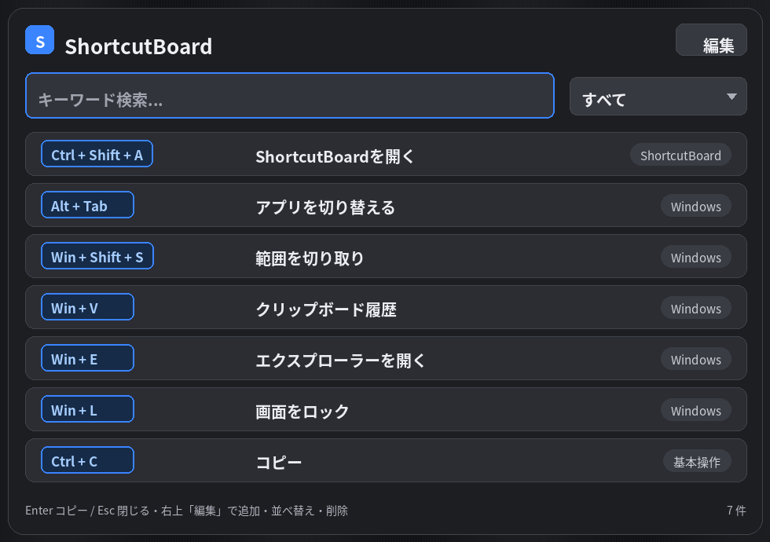
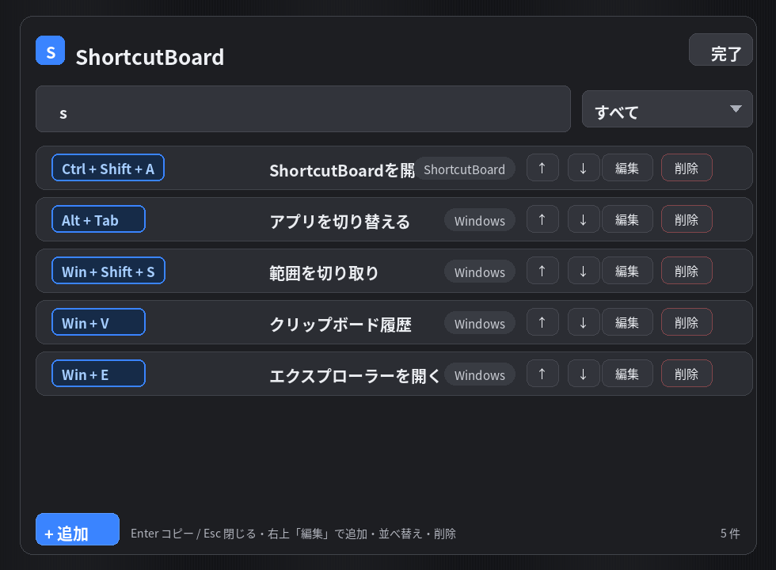

# ShortcutBoard

**よく使うショートカットキーを、自分用にまとめておける Windows 常駐アプリ。**
`Ctrl + Shift + A` を押すだけで、いつでも一覧をパッと表示できます。

> 「あのショートカット、なんだっけ？」をゼロに。自分専用のショートカット早見表。

<!-- スクリーンショットを docs/images/main.png に置いたら、次の1行のコメントを外して有効化してください:

-->

---

## ダウンロード

[**▶ 最新版をダウンロード（Releases）**](../../releases/latest)

- 必要なファイルは **`ShortcutBoard-Setup.exe`** の1つだけ
- **.NET などの事前インストールは不要**（自己完結型）
- Windows 10 / 11（64bit）対応・**無料**

---

## スクリーンショット

### 一覧表示画面

### 編集画面

---

## できること

- 🔑 **グローバルホットキー**：どのアプリを使っていても `Ctrl + Shift + A` で一覧表示
- 🗂 **自分用に編集**：項目の追加・編集・削除・並べ替え（右上「編集」から）
- 🔎 **検索・カテゴリ絞り込み**：たくさん登録しても目的のキーをすぐ発見
- 📋 **キーをコピー**：一覧で `Enter`／ダブルクリックでショートカットキーをコピー
- 🌙 **ダークなUI**＋ふわっと表示、メニューバー（通知領域）に常駐
- 💾 **データはローカル保存**：登録内容は自分の PC 内（`%AppData%\ShortcutBoard`）にのみ保存

初回起動時は、Windows標準の便利ショートカット10件がサンプルとして入っています。
**そのまま自分用に書き換えて**使ってください。

---

## インストール手順

1. [Releases](../../releases/latest) から **`ShortcutBoard-Setup.exe`** をダウンロード
2. ダウンロードした `ShortcutBoard-Setup.exe` をダブルクリック
3. **「WindowsによってPCが保護されました」と出たら**（下記参照）→「詳細情報」→「実行」
4. ウィザードを進める
   - 「**Windows 起動時に自動起動する**」にチェックすると、PC起動時に自動常駐（おすすめ）
5. 完了すると起動し、初回ガイドが表示されます

> 管理者権限は不要です（ユーザー領域にインストールされます）。

### 使い方
| 操作 | 動作 |
|---|---|
| `Ctrl + Shift + A` | ショートカット一覧を表示 |
| `Esc` / ウィンドウ外クリック | 閉じる |
| 右上「編集」 | 追加・編集・削除・並べ替えモード |
| `Enter` / ダブルクリック | 選択中のキーをコピー |
| 通知領域の「S」を右クリック | 一覧を開く / 設定 / 終了 |

ホットキーは **通知領域の「S」→「設定」** から変更できます。

---

## ⚠️ 「WindowsによってPCが保護されました」と表示されたら

個人が作成した無料アプリで、**コード署名（有料）を付けていない**ため、初回に
SmartScreen の警告が出ます。**動作に問題はありません。**

1. 警告画面の **「詳細情報」** をクリック
2. 下に出る **「実行」** ボタンをクリック

これでインストールが進みます。気になる場合は、配布元（このリポジトリの Releases）から
ダウンロードしたファイルであることを確認のうえ実行してください。

---

## アンインストール / データについて

- アンインストール：Windowsの「設定」→「アプリ」→「ShortcutBoard」→「アンインストール」
- 登録データは `%AppData%\ShortcutBoard` に保存され、**アンインストールしても残ります**
  （再インストール時に引き継がれます。不要なら手動削除）

---

## プライバシー

- ネットワーク通信は行いません。登録データはすべて**あなたの PC 内にのみ**保存されます。
- 配布インストーラーには個人データは一切含まれていません。

---

## ライセンス / 注意

個人利用向けの無料アプリです。無保証（at your own risk）でご利用ください。

---

開発メモ・ソース構成・ビルド方法は [ShortcutBoard/README.md](ShortcutBoard/README.md) を参照してください。
